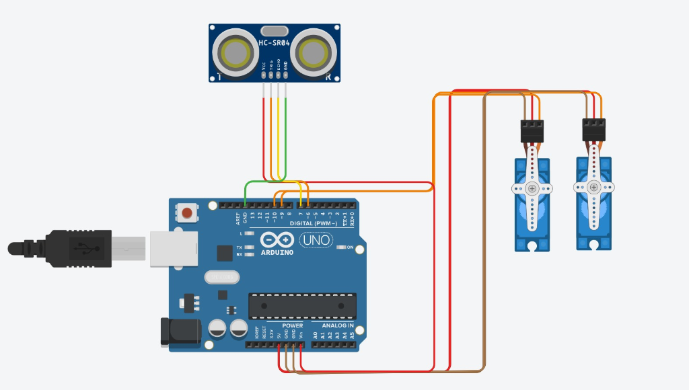
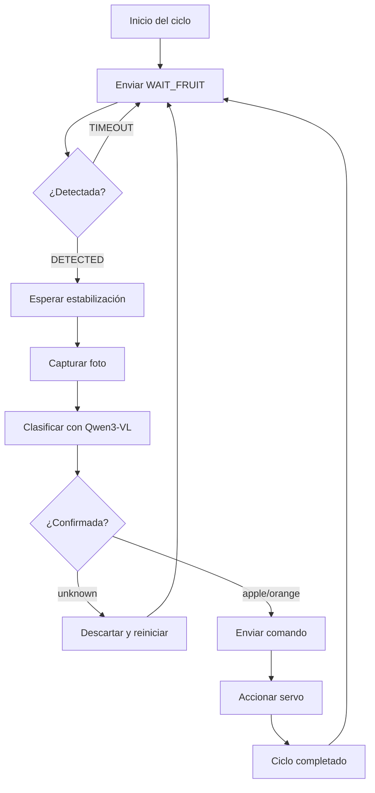

<div align="center">

# Clasificador Automático de Frutas con IA

**Sistema de clasificación física en tiempo real que combina Visión Artificial local con Arduino**


</div>

---

## Descripción del Proyecto

Este proyecto es un **sistema de clasificación de frutas completamente automatizado** que utiliza **Inteligencia Artificial local** y hardware de código abierto para identificar y separar físicamente manzanas y naranjas.

El sistema funciona de la siguiente manera: una fruta se coloca en una rampa; un **sensor ultrasónico** detecta su presencia, una **webcam** captura la imagen y un **modelo de visión artificial** (Qwen3-VL ejecutado localmente en LMStudio) identifica de qué fruta se trata. Finalmente, **servomotores** controlados por Arduino desvían la fruta hacia el contenedor correcto.

Todo el proceso es orquestado por un **servidor MCP** (Model Context Protocol) escrito en Python con FastMCP, lo que permite controlarlo mediante lenguaje natural desde cualquier cliente compatible como Claude Desktop.

### Características Principales

- **Completamente Automático** — Operación continua en bucle infinito sin intervención manual una vez iniciado.
- **Inferencia 100% Local** — Sin dependencias de la nube. El modelo de IA corre localmente con LMStudio.
- **Hardware Accesible** — Componentes económicos y fáciles de conseguir.
- **Protocolo MCP** — Controlable mediante lenguaje natural a través de FastMCP.
- **Validación Multi-foto** — Sistema de votación con múltiples capturas para reducir errores de clasificación.

---

## Hardware

### Componentes utilizados

| Componente | Modelo | Función |
|:---|:---|:---|
| Microcontrolador | **Arduino UNO R3** | Controla los servos y lee el sensor ultrasónico |
| Cámara | **Webcam USB** | Captura imágenes de las frutas para la clasificación por IA |
| Sensor de distancia | **HC-SR04** | Detecta la presencia de una fruta en la posición de escaneo |
| Servomotores (x2) | **MG995** | Accionan las compuertas para desviar las frutas al contenedor correcto |
| Estructura | **Maqueta física** | Rampa con dos compuertas laterales y contenedores de destino |

### Diagrama del Circuito

<div align="center">



</div>

#### Conexiones de pines

| Pin Arduino | Componente | Función |
|:---:|:---|:---|
| `6` | HC-SR04 → Trig | Disparo del pulso ultrasónico |
| `7` | HC-SR04 → Echo | Recepción del eco |
| `9` | Servo MG995 #1 | Compuerta de **manzanas** |
| `10` | Servo MG995 #2 | Compuerta de **naranjas** |
| `5V` | HC-SR04 VCC / Servos VCC | Alimentación |
| `GND` | HC-SR04 GND / Servos GND | Tierra común |

### Maqueta Física

<!-- 
  INSTRUCCIONES: Coloca la foto de tu maqueta en assets/maqueta.jpg
  y descomenta la siguiente línea:
-->
<!--  -->

---

## Arquitectura del Sistema

El sistema se compone de tres capas que se comunican entre sí:

```
┌─────────────────────┐     lenguaje natural     ┌──────────────────────┐
│   Cliente MCP       │ ◄──────────────────────► │   server.py          │
│   (Claude Desktop)  │      (streamable-http)   │   (FastMCP Server)   │
└─────────────────────┘                          └──────┬───────┬───────┘
                                                        │       │
                                              HTTP API  │       │  Serial
                                             (localhost) │       │  (115200 baud)
                                                        ▼       ▼
                                                ┌───────────┐ ┌──────────┐
                                                │ LMStudio  │ │ Arduino  │
                                                │ Qwen3-VL  │ │ UNO R3   │
                                                └───────────┘ └──────────┘
                                                  Clasifica     Sensor +
                                                  la imagen     Servos
```

### Flujo de un ciclo completo



### Comunicación entre componentes

#### 1. `server.py` ↔ Arduino (Serial, 115200 baud)

El servidor Python envía comandos de texto por el puerto serial y espera una respuesta:

| Comando enviado | Respuesta esperada | Acción |
|:---|:---|:---|
| `PING\n` | `PONG` | Verifica que el Arduino está conectado |
| `WAIT_FRUIT\n` | `DETECTED` o `TIMEOUT` | Espera hasta que el sensor detecte un objeto a < 15 cm |
| `APPLE\n` | `OK` | Abre la compuerta de manzanas (servo a 135°) + empuje del servo opuesto |
| `ORANGE\n` | `OK` | Abre la compuerta de naranjas (servo a 45°) + empuje del servo opuesto |

#### 2. `server.py` ↔ LMStudio (HTTP API, localhost:1235)

El servidor captura un frame de la webcam con OpenCV, lo codifica a JPEG en base64 y lo envía como imagen al endpoint `/v1/chat/completions` de LMStudio. El modelo Qwen3-VL analiza la imagen y devuelve la clasificación.

---

## Software — Partes Esenciales del Código

### Prompt de Clasificación de la IA

Este es el prompt exacto que se envía al modelo de visión para clasificar cada fruta. Está diseñado para ser **extremadamente restrictivo**: el modelo solo puede responder con una de tres palabras, evitando respuestas ambiguas o fuera de rango:

```python
"You are a fruit classification system for a sorting machine. "
"Look at this image carefully and identify the fruit.\n\n"
"Rules:\n"
"- If you see an apple (any color: red, green, yellow), respond: apple\n"
"- If you see an orange (round citrus fruit), respond: orange\n"
"- If you see no fruit, or the image is unclear, respond: unknown\n\n"
"Reply with ONLY one word: apple, orange, or unknown.\n"
"No punctuation, no explanation, no extra text."
```

**¿Por qué funciona?**
- `temperature: 0` — Elimina la aleatoriedad. El modelo siempre da la respuesta más probable.
- `max_tokens: 10` — Limita la respuesta a pocas palabras, evitando que el modelo "hable de más".
- Parseo con fallback — Aunque el modelo agregue texto extra, el código extrae la keyword (`apple`, `orange`) si aparece en la respuesta.

### Tools MCP (Herramientas del servidor)

El servidor expone 7 herramientas via MCP que el cliente (Claude Desktop) puede invocar:

| Tool | Descripción |
|:---|:---|
| `take_photo()` | Captura una foto de la webcam y devuelve la imagen en base64 |
| `wait_for_fruit()` | Bloquea hasta que el sensor ultrasónico detecte una fruta |
| `classify_fruit()` | Captura una foto y la envía al modelo de IA para clasificarla |
| `sort_fruit(fruit)` | Envía comando al Arduino para accionar el servo correspondiente |
| `start_sorting_loop()` | **Inicia el bucle automático** de clasificación en segundo plano |
| `stop_sorting_loop()` | Detiene el bucle automático |
| `get_loop_status()` | Devuelve los eventos nuevos del bucle (para que el cliente los narre) |

### Cómo se comunican las Tools entre sí

El sistema tiene dos modos de operación:

**Modo Manual** — El cliente invoca las tools una por una:
```
wait_for_fruit() → classify_fruit() → sort_fruit("apple")
```

**Modo Automático** — El flujo completo corre en un thread en segundo plano:
```
start_sorting_loop()
  └─ Internamente ejecuta en bucle infinito:
       wait_for_fruit → classify_with_retries → sort_fruit
  └─ El cliente solo llama get_loop_status() cada ~5 segundos
       para obtener los eventos nuevos y narrarlos al usuario.
stop_sorting_loop()
```

El `system prompt` del servidor MCP instruye al modelo cliente (Claude) a:
1. Llamar `start_sorting_loop()` cuando el usuario diga "iniciar"
2. Llamar `get_loop_status()` automáticamente cada 3-5 segundos
3. Traducir los eventos a lenguaje natural en español
4. **Nunca** preguntar si desea continuar

### Protocolo Serial del Arduino

El Arduino implementa un protocolo serial simple basado en texto. Cada comando termina en `\n` y cada respuesta termina en `\n`:

```
[server.py]  ──── "WAIT_FRUIT\n" ────►  [Arduino]
[server.py]  ◄──── "DETECTED\n" ─────  [Arduino]  (cuando sensor < 15cm)

[server.py]  ──── "APPLE\n" ────────►  [Arduino]
                                        │ Servo manzana → 135°
                                        │ Servo naranja empuja (105°)
                                        │ Ambos vuelven a 90°
[server.py]  ◄──── "OK\n" ──────────  [Arduino]
```

El mecanismo de **empuje** es clave: cuando se clasifica una manzana, el servo de la manzana abre la compuerta (135°) y el servo de la naranja hace un pequeño empuje (de 90° a 105°) para ayudar a la fruta a rodar hacia el contenedor. Lo mismo ocurre a la inversa.

---

## Demo

<!-- 
  INSTRUCCIONES: Coloca tu video en assets/demo.mp4
  y descomenta la siguiente línea:
-->
<!-- https://github.com/user-attachments/assets/VIDEO_ID -->

---

## Tech Stack

<div align="center">

### IA & Visión


### Software


### Hardware


</div>

---

## Configuración Rápida

### 1. LMStudio
- Descarga e instala [LMStudio](https://lmstudio.ai/).
- Carga el modelo `qwen/qwen3-vl-4b` (o cualquier modelo de visión compatible).
- Inicia un segundo servidor local para analizar la imagen con el comando:
  ```bash
  lms server start --port 1235
  ```

### 2. Arduino
- Abre `fruit_sorter.ino` en el IDE de Arduino.
- Conecta los componentes según el [diagrama del circuito](#diagrama-del-circuito).
- Carga el sketch en tu Arduino UNO.

### 3. Python
```bash
# Instalar dependencias
pip install fastmcp opencv-python pyserial requests

# Configurar el puerto serial en server.py (ej. COM5 en Windows, /dev/ttyACM0 en Linux)
# Ejecutar el servidor
fastmcp run server.py:app --transport=http
```

### 4. Cliente MCP
Conecta un cliente MCP compatible (como Claude Desktop) al servidor y escribe **"Iniciar"** para activar el sistema automático.

---

## Estructura del Repositorio

```
fruit_sorter/
├── server.py              # Servidor FastMCP — orquesta IA, cámara y Arduino
├── fruit_sorter.ino       # Sketch de Arduino — control de servos y sensor
├── assets/
│   ├── circuit_diagram.png   # Diagrama del circuito (Tinkercad)
│   ├── maqueta.jpg           # Foto de la maqueta física
│   └── demo.mp4              # Video demostrativo del sistema
└── README.md              # Este archivo
```

---

<div align="center">

**Hecho por [Jesús Andrés Mondragón Tenorio](https://github.com/AndresMondragon2004)**

[](https://github.com/AndresMondragon2004)
[](https://www.linkedin.com/in/andres-mondragon-tenorio/)

</div>
