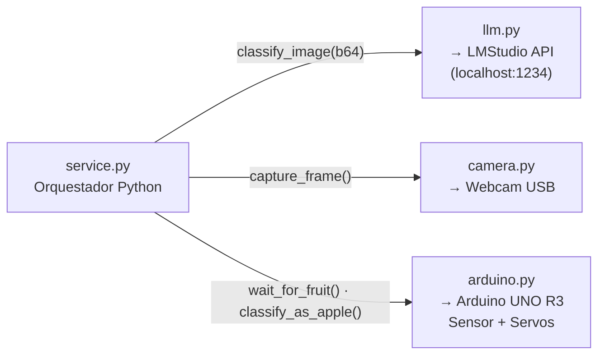
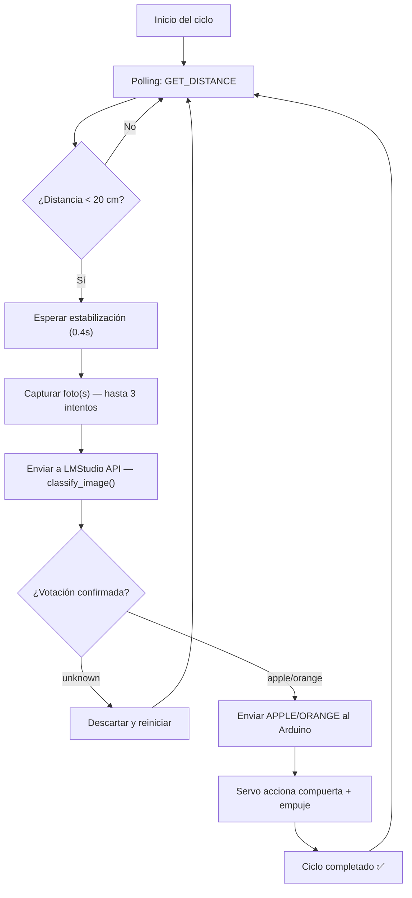

<div align="center">

# Clasificador Automático de Frutas con IA — V2

**Sistema autónomo de clasificación física en tiempo real: Visión Artificial local + Arduino — sin interfaz de chat**


</div>

---

## ¿Qué cambió respecto a V1?

La **V1** dependía del chat de LMStudio como orquestador: el usuario escribía "Iniciar" y el modelo Qwen3-VL activaba las tools MCP desde la conversación. Funcionaba, pero tenía limitaciones:

| Aspecto | V1 | V2 (este repo) |
|:---|:---|:---|
| Orquestación | Chat de LMStudio (MCP client) | **Python autónomo** (`service.py`) |
| Para ejecutar | Abrir LMStudio + cargar modelo + conectar MCP + escribir en el chat | **Solo ejecutar `service.py`** |
| Código | Un solo archivo monolítico (`server.py`, 565 líneas) | **Modular**: `arduino.py`, `camera.py`, `llm.py`, `service.py` |
| Uso del LLM | Doble: orquestador + clasificador de imágenes | **Solo clasificador de imágenes** |
| MCP | Necesario para funcionar | **Opcional** (disponible en `mcp_service.py` para clientes externos) |
| Hardware | Conexiones de un solo uso por comando | **Conexiones persistentes** con auto-reconexión |
| Detección | `WAIT_FRUIT` bloqueante en Arduino | **Polling** por software (`GET_DISTANCE`) |
| Maqueta | Cartón | **Triplay** (en desarrollo) |

### ¿Por qué V2?

En V1, el LLM no podía ejecutar las tools de forma confiable a través del chat de LMStudio cuando se usaba la API directamente. En V2, Python controla todo el flujo directamente: el LLM solo se usa para lo que mejor sabe hacer — **analizar imágenes**.

---

## Descripción del Proyecto

Sistema de clasificación de frutas completamente automatizado que utiliza **Inteligencia Artificial local** y hardware de código abierto para identificar y separar físicamente manzanas y naranjas.

Una fruta se coloca en una rampa; un **sensor ultrasónico** detecta su presencia, una **webcam** captura la imagen y un **modelo de visión artificial** (Qwen3-VL ejecutado localmente en LMStudio) identifica de qué fruta se trata. Finalmente, **servomotores** controlados por Arduino desvían la fruta hacia el contenedor correcto.

### Características Principales

- **Completamente Autónomo** — Solo ejecuta `python service.py` y el sistema opera en bucle infinito.
- **Inferencia 100% Local** — Sin dependencias de la nube. El modelo de IA corre localmente con LMStudio.
- **Arquitectura Modular** — Cada componente (cámara, Arduino, LLM) es un módulo independiente y reutilizable.
- **Hardware Accesible** — Componentes económicos y fáciles de conseguir.
- **Validación Multi-foto** — Sistema de votación con múltiples capturas para reducir errores de clasificación.
- **Configurable por CLI** — Puerto serial, cámara, modelo, umbrales: todo se configura desde la línea de comandos.
- **MCP Opcional** — Servidor MCP incluido para integración con clientes externos (Claude Desktop, etc.).

---

## Hardware

### Componentes utilizados

| Componente | Modelo | Función |
|:---|:---|:---|
| Microcontrolador | **Arduino UNO R3** | Controla los servos y lee el sensor ultrasónico |
| Cámara | **Webcam USB** | Captura imágenes de las frutas para la clasificación por IA |
| Sensor de distancia | **HC-SR04** | Detecta la presencia de una fruta en la posición de escaneo |
| Servomotores (x2) | **MG995** | Accionan las compuertas para desviar las frutas al contenedor correcto |
| Estructura | **Triplay** *(en desarrollo)* | Rampa con dos compuertas laterales y contenedores de destino |

### Diagrama del Circuito

<div align="center">


</div>

#### Conexiones de pines

| Pin Arduino | Componente | Función |
|:---:|:---|:---|
| `6` | HC-SR04 → Trig | Disparo del pulso ultrasónico |
| `7` | HC-SR04 → Echo | Recepción del eco |
| `9` | Servo MG995 #1 | Compuerta de **manzanas** |
| `10` | Servo MG995 #2 | Compuerta de **naranjas** |
| `5V` | HC-SR04 VCC / Servos VCC | Alimentación |
| `GND` | HC-SR04 GND / Servos GND | Tierra común |

---

## Arquitectura del Sistema

En V2, **Python es el orquestador**. LMStudio solo actúa como servidor de visión artificial (API HTTP). No se necesita abrir el chat de LMStudio.



### Flujo de un ciclo completo



### Comunicación entre componentes

#### 1. `arduino.py` ↔ Arduino (Serial, 115200 baud)

Conexión persistente con auto-reconexión. Comandos en texto plano:

| Comando enviado | Respuesta esperada | Acción |
|:---|:---|:---|
| `PING\n` | `PONG` | Verifica que el Arduino está conectado |
| `GET_DISTANCE\n` | `12.34` (distancia en cm) | Lee el sensor ultrasónico |
| `APPLE\n` | `OK` | Abre compuerta manzanas (servo a 135°) + empuje |
| `ORANGE\n` | `OK` | Abre compuerta naranjas (servo a 45°) + empuje |

#### 2. `llm.py` ↔ LMStudio (HTTP API, localhost:1234)

Envía imágenes codificadas en base64 al endpoint `/v1/chat/completions`. El modelo Qwen3-VL analiza la imagen y devuelve **una sola palabra**: `apple`, `orange`, o `unknown`.

---

## Software — Estructura Modular

### Módulos

| Archivo | Responsabilidad |
|:---|:---|
| `service.py` | **Punto de entrada** — bucle autónomo de clasificación |
| `arduino.py` | Comunicación serial con Arduino (persistente, thread-safe) |
| `camera.py` | Captura de imágenes con webcam (persistente, con warmup) |
| `llm.py` | Clasificación de imágenes vía LMStudio API |
| `mcp_service.py` | *(Opcional)* Servidor MCP para clientes externos |

### Prompt de Clasificación de la IA

```python
"You are a fruit classification system for a sorting machine. "
"Look at this image carefully and identify the fruit.\n\n"
"Rules:\n"
"- If you see an apple (any color: red, green, yellow), respond: apple\n"
"- If you see an orange (round citrus fruit), respond: orange\n"
"- If you see no fruit, or the image is unclear, respond: unknown\n\n"
"Reply with ONLY one word: apple, orange, or unknown.\n"
"No punctuation, no explanation, no extra text."
```

**¿Por qué funciona?**
- `temperature: 0` — Elimina la aleatoriedad. El modelo siempre da la respuesta más probable.
- `max_tokens: 10` — Limita la respuesta a pocas palabras.
- Parseo con fallback — Aunque el modelo agregue texto extra, el código extrae la keyword (`apple`, `orange`) si aparece en la respuesta.

### Sistema de Votación

Cuando `min_votes > 1`, el sistema toma múltiples fotos y clasifica cada una independientemente. Solo confirma una fruta si alcanza el número mínimo de votos consistentes:

```
📷 Foto 1 → apple
📷 Foto 2 → apple    ← 2 votos para "apple" → ¡Confirmada! 🍎
```

---

## Configuración Rápida

### 1. LMStudio
- Descarga e instala [LMStudio](https://lmstudio.ai/).
- Carga el modelo `qwen3-vl-4b` (o cualquier modelo de visión compatible).
- Inicia el servidor local:
  ```bash
  lms server start --port 1234
  ```

### 2. Arduino
- Abre `fruit_sorter_nuevo.ino` en el IDE de Arduino.
- Conecta los componentes según el [diagrama del circuito](#diagrama-del-circuito).
- Carga el sketch en tu Arduino UNO.

### 3. Python
```bash
cd llm-arduino-monitor

# Instalar dependencias
pip install -r requirements.txt

# Ejecutar el sistema
python service.py --port COM5 --camera 1
```

### Opciones de línea de comandos

```
python service.py [opciones]

  --port PORT           Puerto serial (default: auto-detect)
  --baud BAUD           Baud rate (default: 115200)
  --camera INDEX        Índice de cámara (default: 0)
  --lm-url URL          URL de la API de LMStudio
  --lm-model MODEL      Nombre del modelo (default: qwen3-vl-4b)
  --threshold CM        Umbral de detección en cm (default: 20.0)
  --sensor-timeout SEG  Timeout del sensor en segundos (default: 30)
  --min-votes N         Votos mínimos para confirmar (default: 1)
  --max-attempts N      Máximo de fotos por detección (default: 3)
```

### Ejemplo de salida

```
────────────────────────────────────────────────────────
  🍓 Fruit Sorter V2 — Autonomous Runner
────────────────────────────────────────────────────────

  Puerto serial   : COM5
  Vision API      : http://127.0.0.1:1234/v1/chat/completions
  Modelo          : qwen3-vl-4b
  Cámara index    : 1

[14:32:01] 🔗 Verificando conexión con LMStudio...
[14:32:02] ✅ LMStudio conectado.
[14:32:02] 🟢 Sistema de clasificación iniciado.
[14:32:02] 🔍 Ciclo 1: Esperando fruta en el sensor...
[14:32:15] 📦 Ciclo 1: ¡Fruta detectada a 8.3cm!

▓▓▓▓▓▓▓▓▓▓▓▓▓▓▓▓▓▓▓▓▓▓▓▓▓▓▓▓▓▓▓▓▓▓▓▓▓▓▓▓▓▓▓▓▓▓▓▓▓▓
  🍎  MANZANA DETECTADA  🍎
  Votos: {'apple': 1}  |  Fotos: 1
▓▓▓▓▓▓▓▓▓▓▓▓▓▓▓▓▓▓▓▓▓▓▓▓▓▓▓▓▓▓▓▓▓▓▓▓▓▓▓▓▓▓▓▓▓▓▓▓▓▓

[14:32:20] 🎉 Ciclo 1: ¡Clasificada exitosamente! Fruta #1
```

---

## MCP Server (Opcional)

Si quieres controlar el sistema desde un cliente MCP externo (Claude Desktop, LMStudio con soporte MCP, etc.), puedes levantar el servidor MCP por separado:

```bash
python mcp_service.py
```

Esto expone las siguientes tools:

| Tool | Descripción |
|:---|:---|
| `ping_machine()` | Verificar conexión con Arduino |
| `get_distance()` | Leer distancia del sensor |
| `wait_for_fruit()` | Esperar detección de fruta |
| `classify_fruit()` | Capturar foto y clasificar |
| `sort_apple()` | Accionar servo para manzana |
| `sort_orange()` | Accionar servo para naranja |

> **Nota:** `service.py` **no requiere** que `mcp_service.py` esté corriendo. Son independientes.

---

## Estructura del Repositorio

```
llm-arduino-monitor/
├── service.py          # Punto de entrada — bucle autónomo de clasificación
├── arduino.py          # Comunicación serial persistente con Arduino
├── camera.py           # Captura de imágenes con webcam (persistente)
├── llm.py              # Clasificación de imágenes vía LMStudio API
├── mcp_service.py      # (Opcional) Servidor MCP para clientes externos
├── requirements.txt    # Dependencias de Python
└── README.md           # Este archivo
```

---

<div align="center">

### Desarrolladores

**[Jesús Andrés Mondragón Tenorio](https://github.com/AndresMondragon2004)**

**[Cristofer Piña Rodriguez](https://github.com/cristoferpina)**

**[Mauricio Sanchez Garcia](https://github.com/mau05126-jpg)**
</div>
