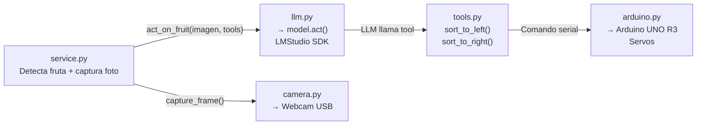
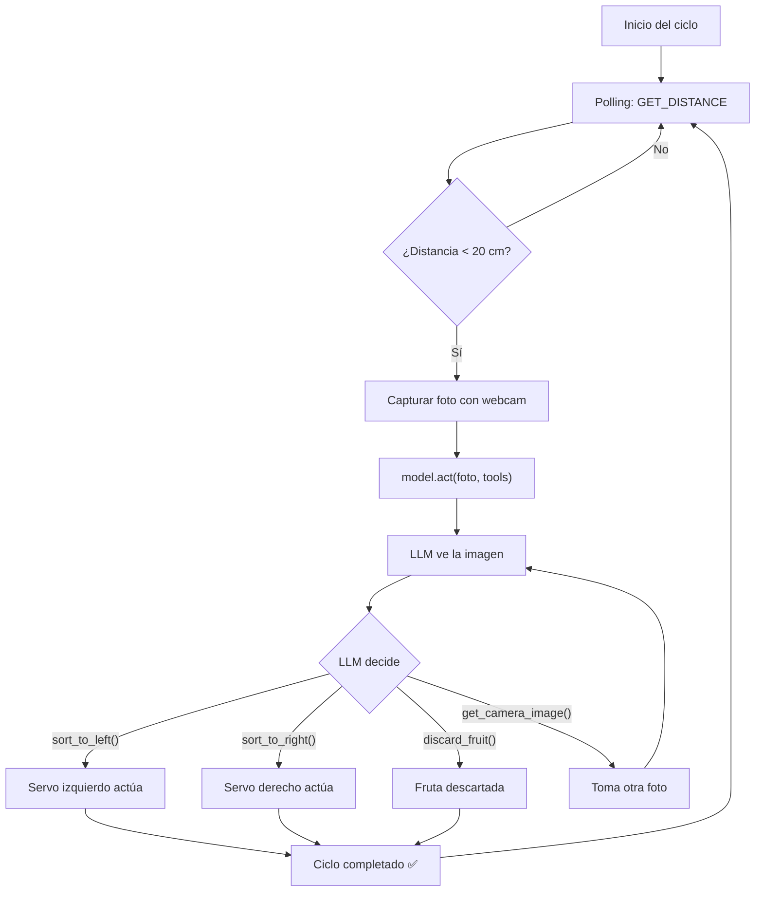

<div align="center">

# Clasificador Automático de Frutas con IA — V3 (Agéntico)

**Sistema autónomo con agente de IA local: el LLM ve, decide y actúa — sin condicionales hardcodeadas**


</div>

---

## ¿Qué cambió respecto a V2?

La **V2** usaba Python como orquestador determinista: el LLM solo clasificaba imágenes y Python decidía con `if apple → servo_izq`. Funcionaba, pero **no era escalable**.

| Aspecto | V2 | V3 (este repo) |
|:---|:---|:---|
| Rol del LLM | Solo clasificador de imágenes (devolvía "apple"/"orange") | **Agente autónomo**: ve la imagen Y llama tools |
| Decisión de sorting | Condicionales en Python (`if label == "apple"`) | **El LLM decide** — llama `sort_to_left()` / `sort_to_right()` |
| Agregar nueva fruta | Modificar código en service.py, llm.py, y Arduino | **Solo editar el system prompt** |
| SDK | HTTP requests manuales | **LMStudio SDK** con `.act()` (tool-calling nativo) |
| Escalabilidad | ❌ Condicionales hardcodeadas | ✅ Prompt-driven — sin límite de frutas |

### ¿Por qué V3?

Si mañana necesitas clasificar **limones, plátanos o mangos**, en V2 tendrías que modificar condicionales en 3 archivos. En V3, solo editas una línea del system prompt: `"Lemons → sort to LEFT"`. El código no cambia.

---

## Descripción del Proyecto

Sistema de clasificación de frutas automatizado con **agente de IA local**. El LLM recibe la imagen de la cámara y usa **tool-calling** para accionar los servos del Arduino directamente — no hay decisiones hardcodeadas en Python.

Una fruta se coloca en una rampa; un **sensor ultrasónico** detecta su presencia, una **webcam** captura la imagen y un **agente LLM** (Qwen3-VL ejecutado localmente en LMStudio) identifica la fruta y **llama la tool correcta** para mover los servos.

### Características Principales

- **Agente Autónomo** — El LLM ve, decide y actúa usando `.act()` del SDK de LMStudio.
- **Escalable por Prompt** — Agregar nuevas frutas solo requiere editar el system prompt.
- **Inferencia 100% Local** — Sin dependencias de la nube. Todo corre en LMStudio.
- **Arquitectura Modular** — Cámara, Arduino, LLM y Tools en módulos independientes.
- **Hardware Accesible** — Componentes económicos y fáciles de conseguir.
- **MCP Opcional** — Servidor MCP incluido para integración con clientes externos.

---

## Hardware

### Componentes utilizados

| Componente | Modelo | Función |
|:---|:---|:---|
| Microcontrolador | **Arduino UNO R3** | Controla los servos y lee el sensor ultrasónico |
| Cámara | **Webcam USB** | Captura imágenes de las frutas para el agente de IA |
| Sensor de distancia | **HC-SR04** | Detecta la presencia de una fruta en la posición de escaneo |
| Servomotores (x2) | **MG995** | Accionan las compuertas para desviar las frutas |
| Estructura | **Triplay** *(en desarrollo)* | Rampa con dos compuertas laterales y contenedores |

### Diagrama del Circuito

<div align="center">


</div>

#### Conexiones de pines

| Pin Arduino | Componente | Función |
|:---:|:---|:---|
| `6` | HC-SR04 → Trig | Disparo del pulso ultrasónico |
| `7` | HC-SR04 → Echo | Recepción del eco |
| `9` | Servo MG995 #1 | Compuerta **IZQUIERDA** |
| `10` | Servo MG995 #2 | Compuerta **DERECHA** |
| `5V` | HC-SR04 VCC / Servos VCC | Alimentación |
| `GND` | HC-SR04 GND / Servos GND | Tierra común |

---

## Arquitectura del Sistema

En V3, el **LLM es el agente**. Python solo detecta la fruta y le pasa la imagen — el modelo decide qué tool llamar.



### Flujo de un ciclo completo



### Comunicación entre componentes

#### 1. `arduino.py` ↔ Arduino (Serial, 115200 baud)

Conexión persistente con auto-reconexión. Comandos en texto plano:

| Comando enviado | Respuesta esperada | Acción |
|:---|:---|:---|
| `PING\n` | `PONG` | Verifica que el Arduino está conectado |
| `GET_DISTANCE\n` | `12.34` (distancia en cm) | Lee el sensor ultrasónico |
| `APPLE\n` | `OK` | Activa servo izquierdo (compuerta a 135°) + empuje |
| `ORANGE\n` | `OK` | Activa servo derecho (compuerta a 45°) + empuje |

#### 2. `llm.py` ↔ LMStudio (SDK nativo, WebSocket)

Usa `model.act()` del SDK oficial de LMStudio. El agente recibe la imagen via `lms.prepare_image()` y usa las herramientas provistas mediante MCP globalmente en LMStudio. El LLM ve la imagen, decide qué fruta es, y **llama la tool correcta nativamente**.

---

## Software — Estructura Modular

### Módulos

| Archivo | Responsabilidad |
|:---|:---|
| `service.py` | **Punto de entrada** — loop de detección + invocación del agente |
| `tools.py` | **Tools del agente** — funciones que el LLM puede llamar (`sort_to_left`, etc.) |
| `llm.py` | **Agente de IA** — `model.act()` con visión + tool-calling |
| `arduino.py` | Comunicación serial con Arduino (persistente, thread-safe) |
| `camera.py` | Captura de imágenes con webcam (persistente, con warmup) |
| `mcp_service.py` | *(Opcional)* Servidor MCP para clientes externos |

### System Prompt del Agente

```python
"You are an autonomous fruit sorting machine controller. "
"You receive images from a camera mounted above a sorting ramp. "
"Your job is to identify the fruit and call the correct sorting tool.\n\n"
"CURRENT SORTING RULES:\n"
"- Apples (any color: red, green, yellow) → sort to LEFT  (call sort_to_left)\n"
"- Oranges (round citrus fruit)           → sort to RIGHT (call sort_to_right)\n"
"- Unknown / unclear / no fruit visible    → discard       (call discard_fruit)\n\n"
```

**¿Cómo agregar una nueva fruta?**

Solo edita el prompt en `llm.py`:
```diff
 "CURRENT SORTING RULES:\n"
 "- Apples (any color: red, green, yellow) → sort to LEFT  (call sort_to_left)\n"
 "- Oranges (round citrus fruit)           → sort to RIGHT (call sort_to_right)\n"
+"- Lemons (yellow citrus fruit)           → sort to LEFT  (call sort_to_left)\n"
 "- Unknown / unclear / no fruit visible    → discard       (call discard_fruit)\n\n"
```

No se necesita modificar ningún otro archivo. ✅

---

## Configuración Rápida

### 1. LMStudio
- Descarga e instala [LMStudio](https://lmstudio.ai/).
- Carga el modelo `qwen3-vl-4b` (o cualquier VLM con soporte de tool-calling):
  ```bash
  lms get qwen/qwen3-vl-4b
  ```
- **Importante:** LMStudio debe estar **abierto como aplicación de escritorio**. El SDK se conecta por WebSocket automáticamente.

### 2. Arduino
- Abre `fruit_sorter_nuevo.ino` en el IDE de Arduino.
- Conecta los componentes según el [diagrama del circuito](#diagrama-del-circuito).
- Carga el sketch en tu Arduino UNO.

### 3. Python
```bash
# Instalar dependencias
pip install -r requirements.txt

# Ejecutar el sistema
python service.py --port COM5 --camera 1
```

### Opciones de línea de comandos

```
python service.py [opciones]

  --port PORT           Puerto serial (default: auto-detect)
  --baud BAUD           Baud rate (default: 115200)
  --camera INDEX        Índice de cámara (default: 0)
  --lm-model MODEL      Nombre del modelo (default: qwen/qwen3-vl-4b)
  --threshold CM        Umbral de detección en cm (default: 20.0)
  --sensor-timeout SEG  Timeout del sensor en segundos (default: 30)
```

### Ejemplo de salida

```
────────────────────────────────────────────────────────
  🍓 Fruit Sorter V3 — Agentic Runner
────────────────────────────────────────────────────────

  Puerto serial   : COM5
  Baud rate       : 115200
  LMStudio SDK    : lmstudio (WebSocket, auto-connect)
  Modelo          : qwen/qwen3-vl-4b
  Cámara index    : 1

[14:32:01] 🔗 Verificando conexión con LMStudio...
[14:32:02] ✅ LMStudio conectado.
[14:32:02] 🟢 Sistema de clasificación iniciado.
[14:32:02] 🔍 Ciclo 1: Esperando fruta en el sensor...
[14:32:15] 📦 Ciclo 1: ¡Fruta detectada a 8.3cm!
[14:32:16] 📷 Ciclo 1: Capturando imagen...
[14:32:16] 🧠 Ciclo 1: Enviando imagen al agente LLM...
[14:32:18]   🔧 Tool ejecutada: sort_to_left → Done. Fruit sorted to LEFT bin.

▓▓▓▓▓▓▓▓▓▓▓▓▓▓▓▓▓▓▓▓▓▓▓▓▓▓▓▓▓▓▓▓▓▓▓▓▓▓▓▓▓▓▓▓▓▓▓▓▓▓
  ✅  FRUTA CLASIFICADA — Ciclo 1  ✅
  Total clasificadas: 1
▓▓▓▓▓▓▓▓▓▓▓▓▓▓▓▓▓▓▓▓▓▓▓▓▓▓▓▓▓▓▓▓▓▓▓▓▓▓▓▓▓▓▓▓▓▓▓▓▓▓
```

---

## Arquitectura MCP Integrada en LMStudio

El sistema V3 está diseñado para aprovechar el **Model Context Protocol (MCP)** consumiendo los recursos a través de un servidor remoto local. De esta forma exponemos nuestras herramientas como un micro-servicio independiente y podemos conectar tantos Servidores MCP como necesitemos en un futuro.

### Configuración del Servidor y Cliente
1. **Inicia tu servidor base:** Mantén este servidor corriendo en segundo plano dentro desde otra terminal antes de consumir la IA, escuchará en el puerto 8000 con tecnología `sse` (Server-Sent Events):
   ```bash
   python mcp_service.py
   ```
2. Abre **LMStudio Desktop** y navega a la tuerca central de **Developer / MCP Server Configuration**.
3. En la configuración local añade una vinculación usando la modalidad `sse` apuntando a tu servidor local. Aquí un ejemplo de configuración aplicable:

```json
{
  "mcpServers": {
    "fruit-sorter-machine": {
      "url": "http://127.0.0.1:8000/sse"
    }
  }
}
```
4. El agente Qwen dentro del SDK de Python automáticamente usará las llaves de este servidor flotante en el aire para enviar señales al Arduino, operando bajo sus propias reglas con cero acoplamiento.

---

## Estructura del Repositorio

```
Clasificador-de-frutas-/
├── service.py          # Punto de entrada — loop de detección + agente
├── tools.py            # Tools que el LLM puede llamar (sort_to_left, etc.)
├── llm.py              # Agente de IA — model.act() con visión + tools
├── arduino.py          # Comunicación serial persistente con Arduino
├── camera.py           # Captura de imágenes con webcam (persistente)
├── mcp_service.py      # (Opcional) Servidor MCP para clientes externos
├── requirements.txt    # Dependencias de Python
└── README.md           # Este archivo
```

---

<div align="center">

### Desarrolladores

**[Jesús Andrés Mondragón Tenorio](https://github.com/AndresMondragon2004)**

**[Cristofer Piña Rodriguez](https://github.com/cristoferpina)**

**[Mauricio Sanchez Garcia](https://github.com/mau05126-jpg)**
</div>
