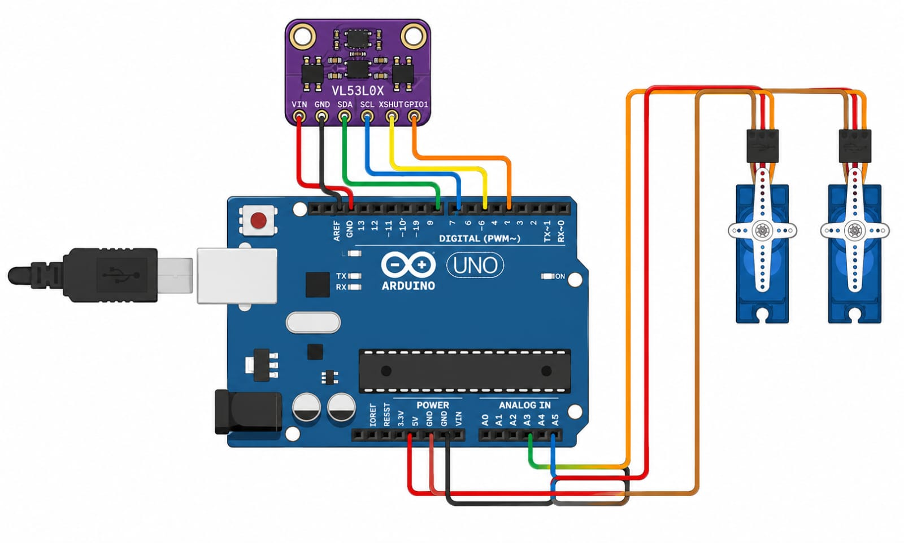
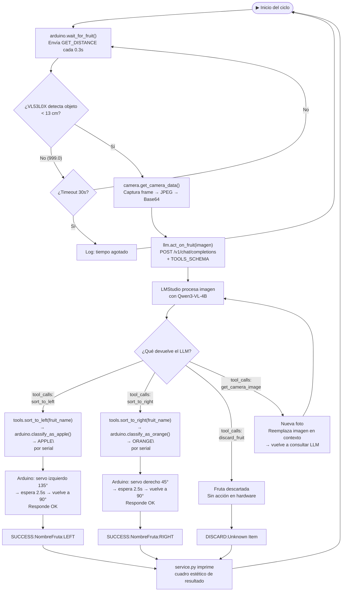
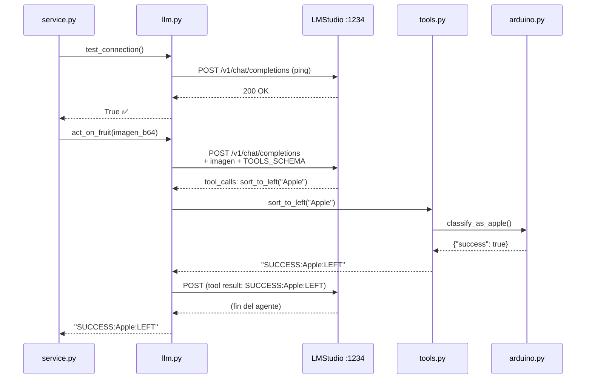

<div align="center">

# Clasificador Automático de Frutas con IA — V4 (Agéntico)

**Sistema autónomo con agente de IA local: el LLM ve, decide y actúa mediante peticiones HTTP directas al servidor OpenAI-compatible de LMStudio.**


</div>

---

## Descripción General

Sistema de clasificación de frutas completamente automatizado con **agente de IA local**. Una fruta se coloca en una rampa; un **sensor láser VL53L0X** detecta su presencia, una **webcam** captura la imagen y un **agente LLM** (Qwen3-VL ejecutado localmente en LMStudio) identifica la fruta y llama la herramienta correcta para mover los servomotores del Arduino — sin decisiones hardcodeadas en Python.

### Características Principales

- **Agente Autónomo** — El LLM ve la imagen, decide y actúa llamando tools vía HTTP.
- **Sensor Láser de Precisión** — VL53L0X (I2C) con rango de detección configurado a 3–13 cm.
- **Comunicación HTTP Estándar** — Usa la librería `requests` con el estándar OpenAI. Compatible con cualquier servidor LLM compatible (LMStudio, Ollama, vLLM, etc.).
- **API Key Soportada** — Autenticación Bearer token explícita en cada petición.
- **Tool-Calling Nativo** — Loop agéntico manual: el LLM devuelve la tool a ejecutar, Python la ejecuta y devuelve el resultado, hasta que la fruta queda clasificada.
- **Escalable por Prompt** — Agregar nuevas frutas solo requiere editar el system prompt.
- **Inferencia 100% Local** — Sin dependencias de la nube.
- **Arquitectura Modular** — Cámara, Arduino, LLM y Tools en módulos independientes.
- **MCP Opcional** — Servidor MCP incluido para integración con clientes externos.

---

## ¿Qué cambió en V4?

La **V4** reemplaza el SDK propietario de LMStudio por la librería estándar `requests`, y migra el sensor HC-SR04 (ultrasónico) al **VL53L0X** (láser I2C) para mayor precisión y simplicidad en el firmware.

| Aspecto | V3 | V4 (este repo) |
|:---|:---|:---|
| Sensor de detección | HC-SR04 (ultrasónico, pines 6 y 7) | **VL53L0X (láser I2C, A4/A5)** |
| Comunicación LLM | LMStudio SDK (WebSocket) | **`requests` (HTTP/JSON)** |
| API Key | No requerida | **Bearer token explícito** |
| Tool Calling | Manejado por el SDK | **Loop agéntico manual** |
| Firmware Arduino | Lógica de empuje de doble servo | **Movimiento simple por servo** |
| Compatibilidad | Solo LMStudio SDK | **Cualquier API OpenAI-compatible** |

---

## Hardware

### Componentes

| Componente | Modelo | Función |
|:---|:---|:---|
| Microcontrolador | **Arduino UNO R3** | Controla los servos y lee el sensor láser |
| Cámara | **Webcam USB** | Captura imágenes de las frutas para el agente |
| Sensor de distancia | **VL53L0X** (Adafruit) | Detecta presencia de fruta por tiempo de vuelo (ToF) láser |
| Servomotores (×2) | **MG995** | Accionan las compuertas para desviar las frutas |
| Estructura | **Triplay** | Rampa con dos compuertas laterales y contenedores |

### Sensor Láser VL53L0X

El **VL53L0X** es un sensor de distancia de **tiempo de vuelo (ToF)** que usa un láser infrarrojo de 940 nm. A diferencia del HC-SR04 (ultrasónico), no requiere pines de Trig/Echo — se comunica por **I2C** con un solo par de cables (SDA/SCL), es más preciso y no tiene problemas de interferencia por ángulo o material de superficie.

| Parámetro | Valor |
|:---|:---|
| Protocolo | I2C (dirección `0x29`) |
| Rango físico | 30 mm – 2000 mm |
| Rango configurado en firmware | **30 mm – 130 mm (3–13 cm)** |
| Modo de precisión | `VL53L0X_SENSE_HIGH_ACCURACY` |
| Valor cuando no hay objeto | `999.0` (fuera de rango o error de medición) |
| Librería Arduino | `Adafruit_VL53L0X` |

### Diagrama del Circuito 

<div align="center">
  
</div>

| Pin Arduino | Componente | Función |
|:---:|:---|:---|
| `A4 (SDA)` | VL53L0X → SDA | Datos I2C (dirección `0x29`) |
| `A5 (SCL)` | VL53L0X → SCL | Reloj I2C |
| `3.3V` | VL53L0X → VCC | Alimentación del sensor |
| `9` | Servo MG995 #1 | Compuerta **IZQUIERDA** (manzanas) |
| `10` | Servo MG995 #2 | Compuerta **DERECHA** (naranjas) |
| `5V` | Servos VCC | Alimentación de los servomotores |
| `GND` | VL53L0X GND / Servos GND | Tierra común |

> **Nota:** El breakout de Adafruit tiene regulador de voltaje incorporado, por lo que también acepta 5V en VCC.

---

## Arquitectura del Sistema

### Diagrama General de Funcionamiento

<div align="center">
  
</div>

Este diagrama ilustra la interacción completa entre el hardware (Arduino, sensores y actuadores) y el flujo de software (módulos de Python e IA local).

### Flujo de un Ciclo Completo


```mermaid
flowchart TD
    Start(["▶ Inicio del ciclo"]) --> Poll["arduino.wait_for_fruit()\nEnvía GET_DISTANCE cada 0.3s"]
    Poll --> Detect{"¿VL53L0X detecta objeto\n< 13 cm?"}
    Detect -- "No (999.0)" --> Timeout{"¿Timeout 30s?"}
    Timeout -- "No" --> Poll
    Timeout -- "Sí" --> SkipLog["Log: tiempo agotado"] --> Start

    Detect -- "Sí" --> Capture["camera.get_camera_data()\nCaptura frame → JPEG → Base64"]
    Capture --> Send["llm.act_on_fruit(imagen)\nPOST /v1/chat/completions\n+ TOOLS_SCHEMA"]

    Send --> LLM["LMStudio procesa imagen\ncon Qwen3-VL-4B"]
    LLM --> Response{"¿Qué devuelve el LLM?"}

    Response -- "tool_calls:\nsort_to_left" --> Left["tools.sort_to_left(fruit_name)\n→ arduino.classify_as_apple()\n→ APPLE\\n por serial"]
    Response -- "tool_calls:\nsort_to_right" --> Right["tools.sort_to_right(fruit_name)\n→ arduino.classify_as_orange()\n→ ORANGE\\n por serial"]
    Response -- "tool_calls:\ndiscard_fruit" --> Discard["Fruta descartada\nSin acción en hardware"]
    Response -- "tool_calls:\nget_camera_image" --> Retry["Nueva foto\nReemplaza imagen en contexto\n→ vuelve a consultar LLM"]
    Retry --> LLM

    Left --> OK1["Arduino: servo izquierdo 135°\n→ espera 2.5s → vuelve a 90°\nResponde OK"]
    Right --> OK2["Arduino: servo derecho 45°\n→ espera 2.5s → vuelve a 90°\nResponde OK"]

    OK1 --> Result["SUCCESS:NombreFruta:LEFT"]
    OK2 --> Result2["SUCCESS:NombreFruta:RIGHT"]
    Discard --> Result3["DISCARD:Unknown Item"]

    Result --> Box["service.py imprime\ncuadro estético de resultado"]
    Result2 --> Box
    Result3 --> Box
    Box --> Start
```

---

## Módulos de Software

### `service.py` — Punto de Entrada y Orquestador

**Es el único archivo que se ejecuta directamente.** Contiene el loop principal que coordina todos los módulos:

1. Verifica conexión con LMStudio (`llm.test_connection()`).
2. Llama `arduino.wait_for_fruit()` en polling hasta detectar una fruta.
3. Captura la imagen con `camera.get_camera_data()`.
4. Pasa imagen al agente `llm.act_on_fruit()`.
5. Imprime el resultado con cuadro estético ANSI.
6. Repite.

También maneja señales SIGINT (Ctrl+C) para cerrar limpiamente la cámara y el puerto serial.

**Funciones clave:**

| Función | Descripción |
|:---|:---|
| `sorting_loop(threshold_cm)` | Loop principal de clasificación |
| `_on_agent_message(role, content)` | Callback que recibe mensajes del agente en tiempo real |
| `print_result_box(status)` | Imprime el resultado en cuadro ANSI coloreado |
| `signal_handler(sig, frame)` | Cierra hardware limpiamente al interrumpir |

**Ejecución:**
```bash
python service.py [--port /dev/ttyUSB0] [--camera 0] [--threshold 13.0]
```

| Argumento | Default | Descripción |
|:---|:---|:---|
| `--port` | Auto-detect | Puerto serial del Arduino (ej. `/dev/ttyUSB0`, `COM5`) |
| `--camera` | `0` | Índice de cámara USB |
| `--threshold` | `13.0` | Distancia máxima de detección en cm |

---

### `llm.py` — Agente de IA (Loop Agéntico)

Contiene toda la lógica de comunicación con LMStudio y el loop de tool-calling. **No tiene estado**: recibe imagen en Base64, ejecuta el loop y devuelve el resultado final.

**Constantes de configuración:**

```python
API_URL         = "http://127.0.0.1:1234/v1/chat/completions"
LMSTUDIO_MODEL  = "qwen/qwen3-vl-4b"
LMSTUDIO_API_KEY = "lm-studio"
```

**Funciones clave:**

| Función | Descripción |
|:---|:---|
| `test_connection()` | Verifica que LMStudio responde antes de iniciar el loop |
| `act_on_fruit(image_b64, on_message)` | Ejecuta el loop agéntico completo. Devuelve `SUCCESS:...` o `DISCARD:...` |

**System Prompt del Agente:**

```
You are an autonomous fruit sorting machine controller.
Identify the fruit and call the correct tool with the fruit's name.

RULES:
- Apples (any color) -> sort_to_left(fruit_name='Specific Apple Type')
- Oranges (any)      -> sort_to_right(fruit_name='Specific Orange Type')
- Unknown/None       -> discard_fruit()

INSTRUCTIONS:
1. Identify the specific variety if possible (e.g. 'Red Gala Apple').
2. Call the tool with the fruit_name argument.
3. No reasoning, just the tool call.
```

**¿Cómo agregar una nueva fruta?** Solo edita el system prompt en `llm.py`:

```diff
 RULES:
 - Apples (any color) -> sort_to_left(fruit_name='Specific Apple Type')
 - Oranges (any)      -> sort_to_right(fruit_name='Specific Orange Type')
+"- Lemons (yellow)   -> sort_to_left(fruit_name='Specific Lemon Type')
 - Unknown/None       -> discard_fruit()
```

No se modifica ningún otro archivo.

---

### `tools.py` — Herramientas del Agente

Define las funciones que el LLM puede invocar. Cada tool tiene **dos partes**:

1. **Implementación Python** — La función real que ejecuta la acción.
2. **Schema JSON (OpenAI format)** — La descripción que se envía al LLM para que sepa cuándo y cómo llamar cada herramienta.

**Tools disponibles:**

| Tool | Parámetro | Acción | Devuelve |
|:---|:---|:---|:---|
| `sort_to_left(fruit_name)` | Nombre de la fruta | Envía `APPLE\n` al Arduino → servo izquierdo | `SUCCESS:NombreFruta:LEFT` |
| `sort_to_right(fruit_name)` | Nombre de la fruta | Envía `ORANGE\n` al Arduino → servo derecho | `SUCCESS:NombreFruta:RIGHT` |
| `discard_fruit()` | — | No actúa en hardware | `DISCARD:Unknown Item` |
| `get_camera_image()` | — | Captura nueva foto (si la primera fue poco clara) | `NEW_IMAGE_READY` |

El diccionario `AVAILABLE_FUNCTIONS` mapea nombre → función Python para el dispatch dinámico en `llm.py`.

---

### `arduino.py` — Comunicación Serial con Arduino

Gestiona la conexión serial con el Arduino. La conexión es **persistente** (se abre una sola vez y se reutiliza), **thread-safe** (con `threading.Lock`) y **auto-reconectable** (si el puerto se cierra, el siguiente comando lo reabre).

**Funciones clave:**

| Función | Descripción |
|:---|:---|
| `send_command(command, timeout)` | Envía un comando por serial y espera la respuesta. Base de todas las demás funciones. |
| `ping()` | Envía `PING\n` y verifica que el Arduino responda `PONG` |
| `get_distance()` | Envía `GET_DISTANCE\n` y devuelve la distancia en cm como `float` |
| `wait_for_fruit(threshold_cm, timeout_seconds)` | Hace polling del sensor cada 0.3s hasta detectar objeto < `threshold_cm` o agotar el timeout |
| `classify_as_apple()` | Envía `APPLE\n` → activa servo izquierdo |
| `classify_as_orange()` | Envía `ORANGE\n` → activa servo derecho |
| `close()` | Cierra el puerto serial limpiamente |

**Auto-detección de puerto:** Si `SERIAL_PORT = None`, el módulo escanea puertos disponibles en Linux (`/dev/ttyUSB*`, `/dev/ttyACM*`) y Windows (`COM*`).

---

### `camera.py` — Captura de Imágenes

Gestiona la webcam USB con una conexión **persistente** (el dispositivo no se abre y cierra en cada captura) y **thread-safe**. Incluye warmup de frames para evitar capturas oscuras o inestables al inicio.

**Funciones clave:**

| Función | Descripción |
|:---|:---|
| `capture_frame()` | Captura un frame crudo de OpenCV |
| `frame_to_base64(frame, max_size)` | Redimensiona a ≤384px, codifica como JPEG (calidad 75) y devuelve Base64 |
| `get_camera_data()` | Combina las anteriores — devuelve el string Base64 listo para enviar al LLM |
| `close()` | Libera la cámara limpiamente |

**Optimizaciones:** Las imágenes se redimensionan a máximo 384×384px antes de enviarlas al LLM para reducir el uso de tokens y acelerar la inferencia.

---

### `mcp_service.py` — Servidor MCP (Opcional)

**No es necesario para el funcionamiento normal del sistema.** `service.py` controla el hardware directamente sin pasar por este módulo.

Expone las mismas funciones de hardware como herramientas **MCP (Model Context Protocol)** usando la librería `FastMCP` con transporte **SSE (Server-Sent Events)** en el puerto 8000. Esto permite conectar clientes MCP externos (Claude Desktop, LMStudio con MCP, etc.) para controlar la máquina directamente.

**Tools MCP expuestas:**

| Tool MCP | Función equivalente |
|:---|:---|
| `ping_machine()` | `arduino.ping()` |
| `get_distance()` | `arduino.get_distance()` |
| `wait_for_fruit(threshold_cm, timeout_seconds)` | `arduino.wait_for_fruit()` |
| `capture_photo()` | `camera.get_camera_data()` |
| `sort_to_left()` | `tools.sort_to_left()` |
| `sort_to_right()` | `tools.sort_to_right()` |

**Ejecución:**
```bash
python mcp_service.py
# Servidor escuchando en http://127.0.0.1:8000/sse
```

---

## Cómo Funciona `requests`

La librería `requests` es una librería HTTP de Python que permite hacer peticiones web de forma simple. En este proyecto reemplaza al SDK propietario de LMStudio, que usaba WebSockets.

**¿Qué hace exactamente en este proyecto?**

Cada vez que el agente necesita consultar al LLM, `llm.py` hace un **HTTP POST** al servidor local de LMStudio:

```python
response = requests.post(
    url     = "http://127.0.0.1:1234/v1/chat/completions",
    headers = {
        "Content-Type":  "application/json",
        "Authorization": "Bearer lm-studio"   # ← API Key
    },
    json = {
        "model":       "qwen/qwen3-vl-4b",
        "messages":    [...],   # historial de la conversación
        "tools":       TOOLS_SCHEMA,   # descripción de las tools disponibles
        "tool_choice": "auto"
    }
)
```

LMStudio responde con un JSON en formato OpenAI estándar. Python parsea la respuesta para determinar si el LLM quiere llamar una tool o terminar.

**Ventajas sobre el SDK:**
- Funciona con **cualquier servidor compatible con OpenAI**: LMStudio, Ollama, vLLM, OpenAI real, etc.
- La API Key se envía explícitamente en cada petición.
- No depende de binarios o versiones específicas del SDK.
- El código es transparente — se puede ver exactamente qué se envía y recibe.

---

## Cómo Funciona el Tool-Calling (Loop Agéntico)

El tool-calling es el mecanismo que permite al LLM **invocar funciones de Python** como respuesta a una imagen. El proceso es un loop de petición-respuesta entre Python y el LLM:

```
┌─────────────────────────────────────────────────────────────┐
│                    LOOP AGÉNTICO (máx. 5 iteraciones)        │
│                                                             │
│  1. Python construye el mensaje con la imagen en Base64     │
│  2. Python envía POST a LMStudio con el TOOLS_SCHEMA        │
│  3. LMStudio procesa imagen y decide qué tool llamar        │
│  4. LMStudio responde con tool_calls (nombre + argumentos)  │
│  5. Python ejecuta la función localmente                    │
│  6. Python envía el resultado como mensaje "tool" al LLM    │
│  7. Si el resultado es SUCCESS o DISCARD → el loop termina  │
│  8. Si no → el LLM puede pedir otra tool → vuelve al paso 3 │
└─────────────────────────────────────────────────────────────┘
```

**Ejemplo de intercambio real:**

```
Python → LMStudio:
  {role: "user", content: [imagen_base64, "Sort this fruit."]}
  tools: [sort_to_left, sort_to_right, discard_fruit, get_camera_image]

LMStudio → Python:
  {role: "assistant", tool_calls: [{
    function: {name: "sort_to_left", arguments: '{"fruit_name": "Red Gala Apple"}'}
  }]}

Python ejecuta: tools.sort_to_left("Red Gala Apple")
  → arduino.classify_as_apple() → envía "APPLE\n" al Arduino
  → Arduino activa servo izquierdo → responde "OK"
  → devuelve "SUCCESS:Red Gala Apple:LEFT"

Python → LMStudio:
  {role: "tool", content: "SUCCESS:Red Gala Apple:LEFT"}

→ El loop detecta "SUCCESS..." y termina. ✅
```

**¿Qué pasa si la imagen no es clara?**

El LLM puede llamar `get_camera_image()` para solicitar una nueva foto. En ese caso, Python captura otro frame y **reemplaza la imagen en el historial** (en lugar de agregar un mensaje nuevo) para no desperdiciar tokens de contexto.

---

## Conexión con LMStudio

LMStudio actúa como un servidor HTTP local que expone una API compatible con OpenAI. El sistema se conecta así:


```mermaid
sequenceDiagram
    participant S as service.py
    participant L as llm.py
    participant LM as LMStudio :1234
    participant T as tools.py
    participant A as arduino.py

    S->>L: test_connection()
    L->>LM: POST /v1/chat/completions (ping)
    LM-->>L: 200 OK
    L-->>S: True ✅

    S->>L: act_on_fruit(imagen_b64)
    L->>LM: POST /v1/chat/completions<br/>+ imagen + TOOLS_SCHEMA
    LM-->>L: tool_calls: sort_to_left("Apple")
    L->>T: sort_to_left("Apple")
    T->>A: classify_as_apple()
    A-->>T: {"success": true}
    T-->>L: "SUCCESS:Apple:LEFT"
    L->>LM: POST (tool result: SUCCESS:Apple:LEFT)
    LM-->>L: (fin del agente)
    L-->>S: "SUCCESS:Apple:LEFT"
```

**Requisitos de LMStudio:**
- LMStudio debe estar **abierto como aplicación de escritorio** con el servidor activado.
- El servidor local debe estar en `http://127.0.0.1:1234`.
- El modelo debe tener soporte de **visión (VLM)** y **tool-calling**.

### Configuración del Modelo

```bash
# Descargar el modelo recomendado
lms get qwen/qwen3-vl-4b

# O en la interfaz de LMStudio:
# Developer → Local Server → Load Model → qwen3-vl-4b → Start Server
```

---

## Protocolo Serial Arduino

La comunicación entre Python (`arduino.py`) y el firmware (`.ino`) es texto plano a 115200 baud.

| Comando enviado | Respuesta esperada | Acción en Arduino |
|:---|:---|:---|
| `PING\n` | `PONG` | Verificación de conexión |
| `GET_DISTANCE\n` | `"12.34"` (float en cm) | Lee el VL53L0X y devuelve distancia |
| `APPLE\n` | `OK` | Servo izquierdo: 90° → 135° → espera 2.5s → 90° |
| `ORANGE\n` | `OK` | Servo derecho: 90° → 45° → espera 2.5s → 90° |

**Casos especiales del sensor:**
- Si `RangeStatus == 4` (out of range): devuelve `999.0`
- Si la lectura está fuera de 30–130mm: devuelve `999.0`
- En `wait_for_fruit()`, Python descarta cualquier valor ≥ `threshold_cm` y sigue haciendo polling

**Inicialización:** Al encender, el Arduino responde `READY` por serial. Si el sensor VL53L0X no inicializa correctamente, envía `ERROR:SENSOR_INIT` y entra en loop infinito.

---

## Configuración Rápida

### 1. LMStudio

1. Descarga e instala [LMStudio](https://lmstudio.ai/).
2. Carga el modelo con soporte de visión y tool-calling:
   ```
   lms get qwen/qwen3-vl-4b
   ```
3. En LMStudio Desktop: **Developer → Local Server → Start Server** (puerto 1234).

### 2. Arduino

1. Instala la librería `Adafruit_VL53L0X` desde el Library Manager del IDE de Arduino.
2. Conecta los componentes según la [tabla de pines](#conexiones-de-pines).
3. Abre `fruit_sorter_nuevo.ino` y cárgalo en tu Arduino UNO.
4. Verifica en el Monitor Serial (115200 baud) que aparezca `READY`.

### 3. Python

```bash
# Instalar dependencias
pip install -r requirements.txt

# Ejecutar el sistema
python service.py --port /dev/ttyUSB0 --camera 0 --threshold 13.0
```

### Ejemplo de Salida en Consola

```
━━━━━━━━━━━━━━━━━━━━━━━━━━━━━━━━━━━━━━━━━━━━━━━━━━━━━━━━━━━━
  🍓 Fruit Sorter V4+ — Agentic Runner
━━━━━━━━━━━━━━━━━━━━━━━━━━━━━━━━━━━━━━━━━━━━━━━━━━━━━━━━━━━━

  Puerto Serial  : /dev/ttyUSB0
  Comunicación   : HTTP (Direct Requests)
  API Key        : lm-studio
  Modelo         : qwen/qwen3-vl-4b
  Cámara Index   : 0

[14:32:01] 🟢 Sistema de clasificación iniciado.
[14:32:01] 🔍 Ciclo 1: Esperando fruta en el sensor...
[14:32:15] 📦 Ciclo 1: ¡Fruta detectada a 8.3cm!
[14:32:16] 📷 Ciclo 1: Capturando imagen...
[14:32:16] 🧠 Ciclo 1: Analizando con IA (Agente V4+)...
[14:32:17]   🔧 IA llamando a: sort_to_left({'fruit_name': 'Red Gala Apple'})

    ┏━━━━━━━━━━━━━━━━━━━━━━━━━━━━━━━━━━━━━━━━━━━━━━━━━━┓
    ┃  🍎  FRUTA CLASIFICADA                            ┃
    ┃  IDENTIFICADO: RED GALA APPLE                     ┃
    ┃  ACCIÓN: MOVER A LEFT                             ┃
    ┗━━━━━━━━━━━━━━━━━━━━━━━━━━━━━━━━━━━━━━━━━━━━━━━━━━┛
```

---

## Sistema MCP (Opcional)

Si quieres controlar la máquina desde un cliente MCP externo (Claude Desktop, LMStudio con MCP):

1. Inicia el servidor MCP:
   ```bash
   python mcp_service.py
   # Servidor SSE en http://127.0.0.1:8000/sse
   ```

2. En LMStudio Desktop → **Developer → MCP Server Configuration**:
   ```json
   {
     "mcpServers": {
       "fruit-sorter-machine": {
         "url": "http://127.0.0.1:8000/sse"
       }
     }
   }
   ```

3. El cliente MCP podrá llamar directamente `sort_to_left`, `get_distance`, `capture_photo`, etc.

> **Importante:** `mcp_service.py` y `service.py` **no deben correr al mismo tiempo** sobre el mismo puerto serial — ambos necesitarían acceso exclusivo al Arduino.

---

## Estructura del Repositorio

```
Clasificador-de-frutas-/
│
├── service.py           # ▶ PUNTO DE ENTRADA — loop de detección y clasificación
├── llm.py               # Agente de IA — loop agéntico via requests (HTTP/OpenAI)
├── tools.py             # Herramientas del LLM — schemas JSON + implementaciones Python
├── arduino.py           # Comunicación serial persistente con Arduino (VL53L0X + servos)
├── camera.py            # Captura de imágenes con webcam (conexión persistente)
├── mcp_service.py       # (Opcional) Servidor MCP via FastMCP + SSE
│
├── fruit_sorter_nuevo.ino   # Firmware Arduino: VL53L0X (I2C) + 2× servo MG995
├── requirements.txt         # Dependencias Python
│
└── assets/
    ├── circuit_diagram.png  # Diagrama del circuito
    ├── maqueta.jpeg         # Foto de la maqueta física
    ├── demo.gif             # Demo animado
    └── demo.mp4             # Demo en video
```

### Dependencias Python (`requirements.txt`)

| Librería | Uso |
|:---|:---|
| `opencv-python` | Captura y procesamiento de imágenes de la webcam |
| `pyserial` | Comunicación serial con el Arduino |
| `requests` | Peticiones HTTP al servidor OpenAI-compatible de LMStudio |
| `fastmcp` | Servidor MCP con transporte SSE (solo `mcp_service.py`) |
| `colorama` | Colores ANSI en consola (compatibilidad Windows) |

---

<div align="center">

### Desarrolladores

**[Jesús Andrés Mondragón Tenorio](https://github.com/AndresMondragon2004)**

**[Cristofer Piña Rodriguez](https://github.com/cristoferpina)**

**[Mauricio Sanchez Garcia](https://github.com/mau05126-jpg)**

</div>
